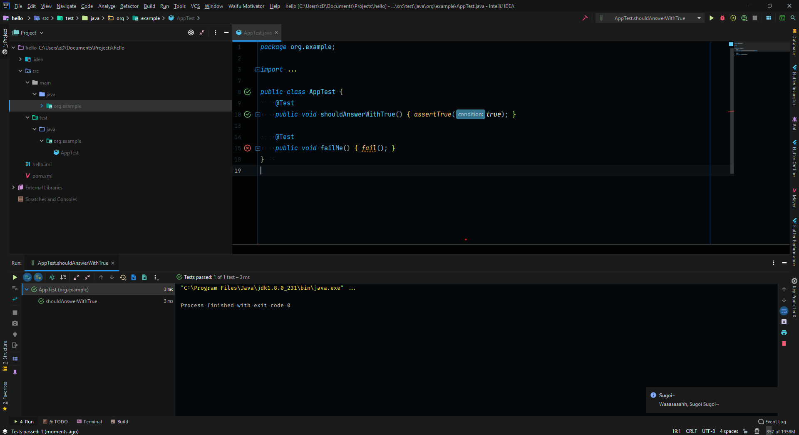
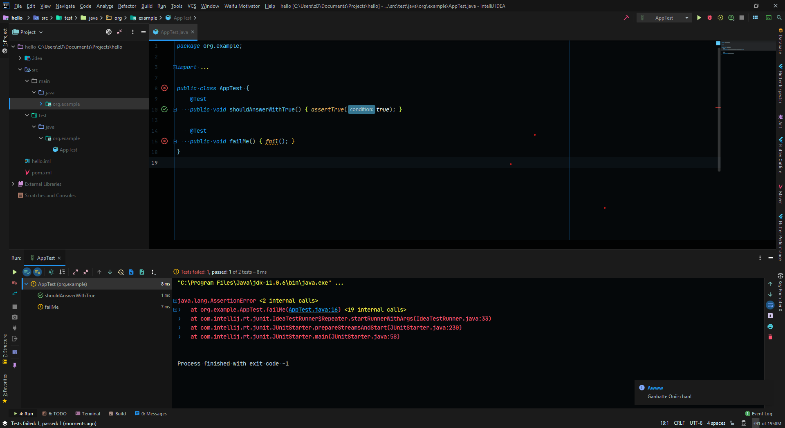
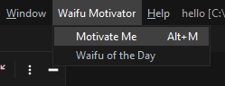
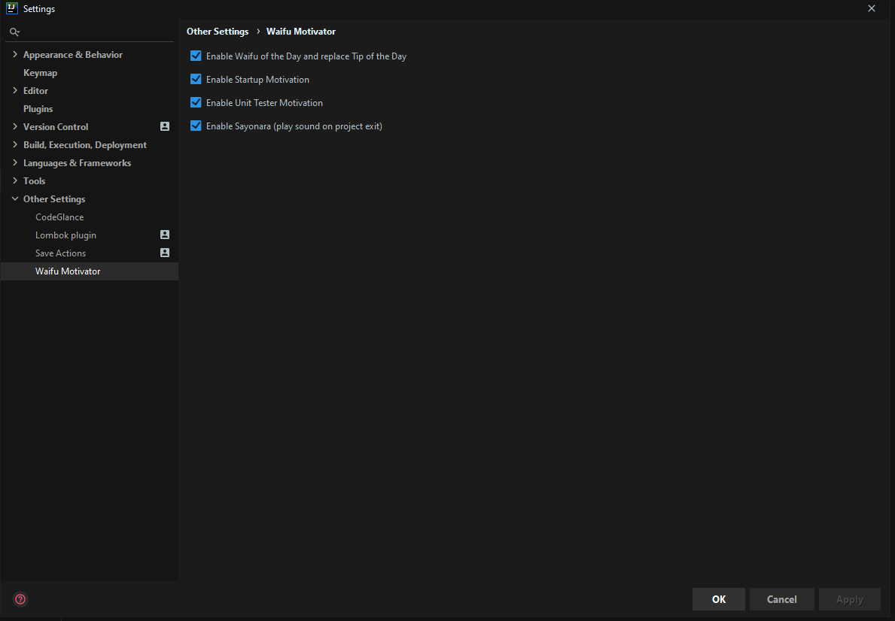
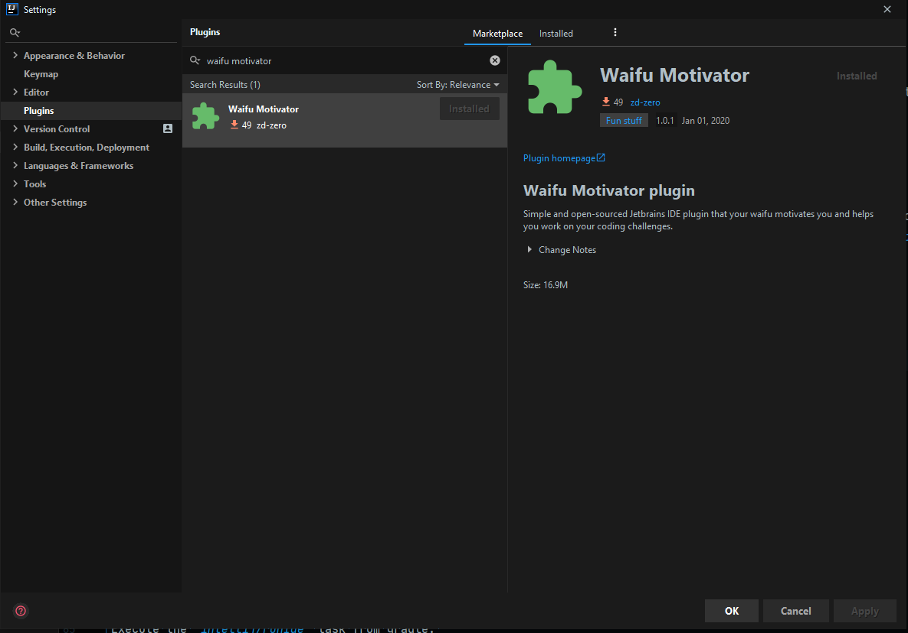

<p align="center"></p>
<h2 align="center">Waifu Motivator Plugin</h2> 

<!--suppress HtmlDeprecatedAttribute, HtmlRequiredAltAttribute -->
<p align="center">
    <a href="https://github.com/zd-zero/waifu-motivator-plugin/actions"></a>
  <a href="https://plugins.jetbrains.com/plugin/13381-waifu-motivator"></a>
  <a href="./LICENSE"></a>
</p>

<p align="center">
  
</p>

<p align="center">Simple and open-sourced Jetbrains IDE plugin that your waifu motivates you and helps you work on your coding challenges.</p>

> *Waifu* is a term for a fictional character, usually in anime or related media, that someone has great, and sometimes romantic, affection for. [source](https://www.dictionary.com/e/fictional-characters/waifu/)


## Waifu of the Day
Why need a Tip of the day when you can have Waifu of the Day. This feature replaces the out of the box Tip of the Day of Intellij and shows some waifu!

<p align="center">
  
</p>

*It only shows up once a day at the project startup and you can view it at the 'Waifu Motivator' tool menu.*

## Waifu Unit Tester
Your waifu motivates you whenever a test passes or fails. 

**Test Pass**


*When a test passes it'll rejoice with you together with their voice/sound.*

**Test Fails**


*When a test fails it'll cheer you up for you to not get demotivated*

## Waifu Motivation On-demand
Whenever you feel demotivated on your task, you can request a motivation that randomly plays a sound and a notification to cheer you up.

<p align="center">
  
</p>

## Waifu Settings
Of course, not all the time you're okay with your waifu, there are bad times after all and sometimes you'll get annoyed by them and not wanting to hear anything from them. You can configure it through the settings (`Settings > Other Settings > Waifu Motivator`).



# Getting Started
If you'd like to use it to your Intellij IDE or run it to your local machine for development, please see the following sections.

## Usage
To install the plugin, go to `Settings > Plugins > Marketplace Tab > Search for 'Waifu Motivator'`.


## Contributing
### Prerequisites
* JDK 8+
* Intellij IDEA
* Plugin DevKit 
* Lombok Plugin

### Running
Execute the `intellij/runIde` task from gradle. 
```
./gradlew runIde
```
This will open up a new Intellij IDE that the plugin is installed.

### Plugin Image


Art by [@gweninja](https://www.instagram.com/gweninja/)

## License
This project is licensed under MIT License - see [LICENSE](./LICENSE) file for details.

## Disclaimer
There are resources used in the [sound](./src/main/resources/sound) directory that is pulled from the internet randomly and most of it is clipped, if you own it please email me so that I could remove it here.

