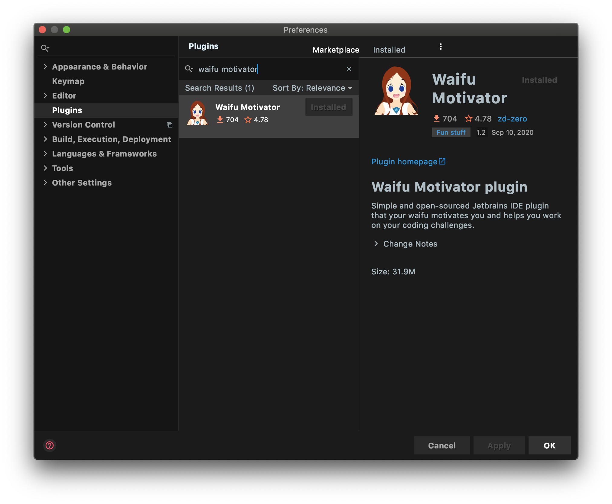
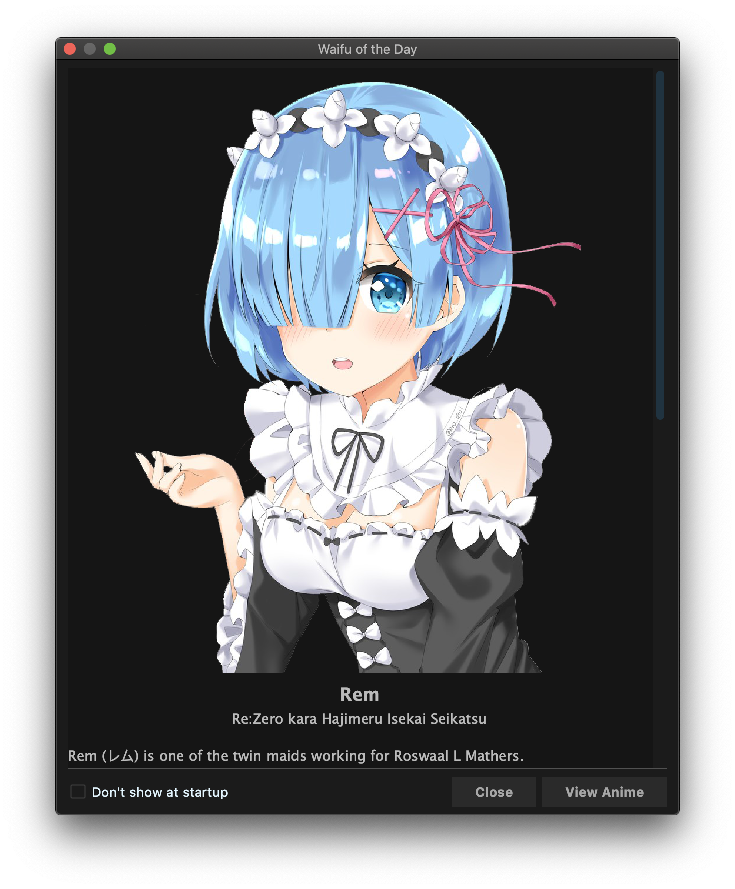
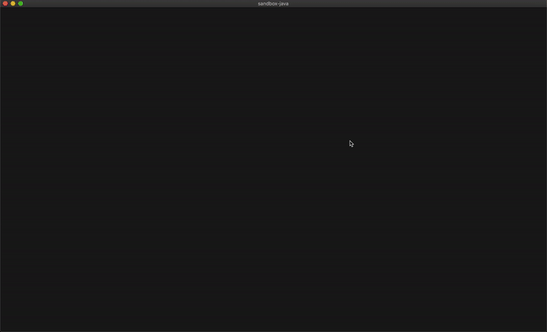
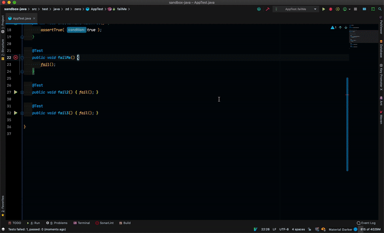
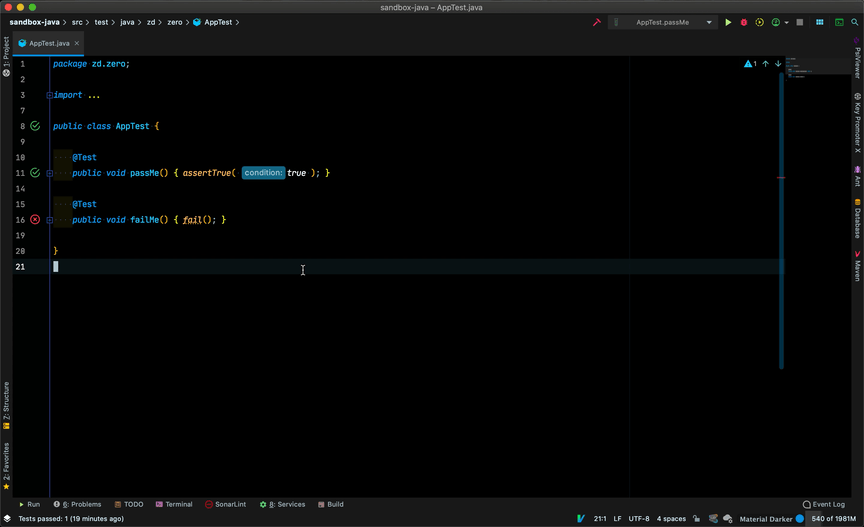
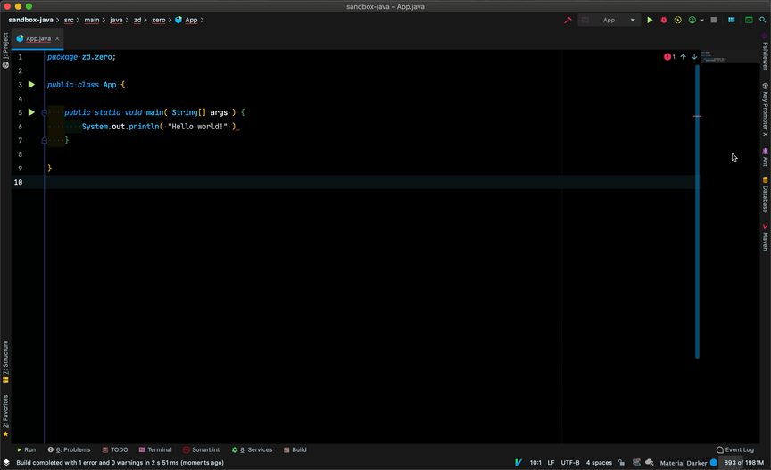
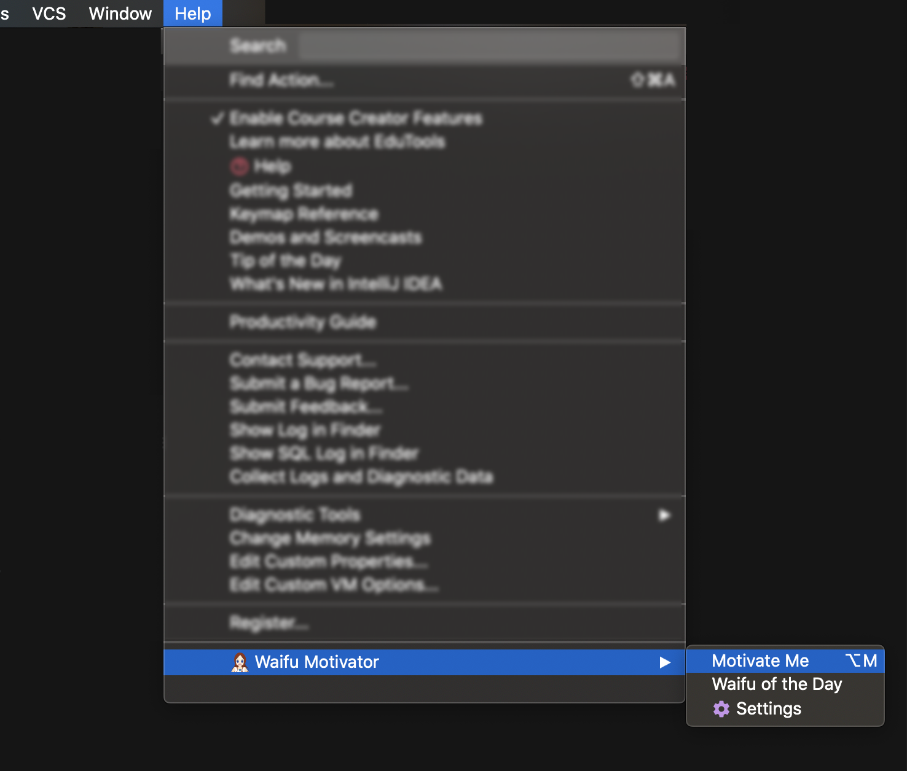
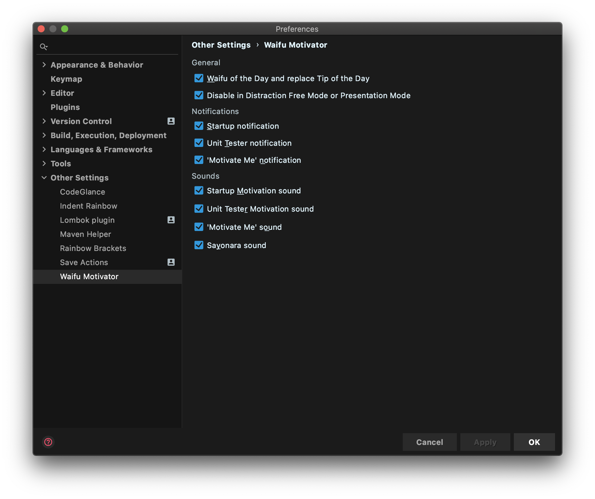

<p align="center"></p>
<h2 align="center">Waifu Motivator Plugin</h2>

<!--suppress HtmlDeprecatedAttribute, HtmlRequiredAltAttribute -->
<p align="center">
    <a href="https://github.com/zd-zero/waifu-motivator-plugin/actions"></a>
  <a href="https://plugins.jetbrains.com/plugin/13381-waifu-motivator"></a>
  <a href="./LICENSE"></a>
</p>

<p align="center">
  
</p>

<p align="center">An open-sourced Jetbrains IDE plugin that brings in your <i>Waifu</i> to help motivate you to complete your coding challenges.</p>

**What is a Waifu?** 🤷

> *Waifu* is a term for a fictional character, usually in anime or related media, that someone has great, and sometimes romantic, affection for. [source](https://www.dictionary.com/e/fictional-characters/waifu/)

## Installation
To install the plugin, go to `Settings | Plugins | Marketplace Tab | Search for 'Waifu Motivator'`.
You can install it from [the plugin marketplace.](https://plugins.jetbrains.com/plugin/13381-waifu-motivator).



## Waifu of the Day
Why would you want the _Tip of the Day_, when instead you can have a _Waifu of the Day_?
This feature replaces the out of the box Tip of the Day feature of IntelliJ with a top-tier *Waifu*!

<p align="center">
  
</p>

*This only shows up once a day at the project startup, and you can also view it at the 'Waifu Motivator' tool menu.*

## Motivation Events

Your new virtual companion has the ability to react to various events triggered by your IDE.
As you build your code, they will present various visual indications of their reactions.

### Starting Up
Your *Waifu* loves to welcome you, make sure to keep coming back!


### Test Runs

Your *Waifu* will motivate you whenever your tests pass or fail.

**Passing tests**


*When a test passes your companion will rejoice with you together with their voice/sound.*

**Failing Tests**


*When a test fails they will cheer you up, so you can overcome your challenges/frustrations.*
_Also you don't want to disappoint you waifu, now do you?_

### Idling

Your *Waifu* likes spending time with you, and they will miss you when you are gone.
When you go away, after some time your *Waifu* will show that they are waiting patiently for your return.
It's either that, or they got tired from waiting!



### Exit Codes

Not every program that you start runs correctly or completes successfully.
You *Waifu* knows that for a fact, so they can act just as surprised as you are when your applications fail to run!


### Tasks

Writing code is hard sometimes, your *Waifu* understands.
So when you trigger various tasks that fail, they will cheer you up when things don't go your way.
Such as when you build/compile your application, and it fails because you **are missing a darned ;** your *Waifu* has got you covered!



## Personality

Your *Waifu* is a fairly moody state machine and has many reactions to various events such as:
- She waits for you to come back when you are away for some time
- She is happy when your test pass.
- She gets sad when your builds break and tests fail.
- She gets over come with joy when you fix your tests and make your code compile.

She also has the ability to feel your frustration when **things aren't working, WHY ARE THEY NOT WORKING!!**.
Your *Waifu* figures its good to inject a little humor into the mix and show you that she is frustrated as well.


They also have the capability from evolving from being frustrated to full-blown rage.
This only happens when you have been triggering events in the frustration state for a given period.

Not every person wants their *Waifu* to get frustrated.
Thankfully, you have the ability to disable this part of her personality, by preventing her from ever being frustrated in the first place! 😄

## Motivation On-demand
Whenever you feel demotivated on your task, you can request motivation from your *Waifu*.
Your companion will randomly play a sound and show a *Waifu* to cheer you up.
You can invoke it on `Help | Waifu Motivator | Motivate Me` or the shortcut key with (`alt + M` for Windows/Linux and `option + M` for MacOs).

<p align="center">
  
</p>

## Offline Mode

Take your *Waifu* with you as you go.
You have the ability to write code off the grid and still get motivation events!

## Plugin Settings

Your new *Waifu* is pretty chatty, sometimes that is okay and sometimes it is not.
Thankfully, you have the ability to configure what your waifu does via the settings menu (`Settings | Other Settings | Waifu Motivator`).



# Development

## Getting Started

If want to run it to your local machine for development, please see the following sections.

## Contributing
### Prerequisites
* JDK 11+
* IntelliJ IDEA
* Plugin DevKit
* Lombok Plugin

### Running
Execute the `intellij/runIde` task from Gradle.
```
./gradlew runIde
```
This will fire up a new IntelliJ IDE instance with the plugin already installed.

### Plugin Image


Art by [@gweninja](https://www.instagram.com/gweninja/)

## License
The license of this project is under MIT License - see [LICENSE](./LICENSE) file for details.

## Disclaimer
There are resources used in the [sound](./src/main/resources/sound) directory that is pulled randomly from the internet, I do *not* own it as they are clipped/trimmed, if you own it please contact me so that I could remove it from here.
